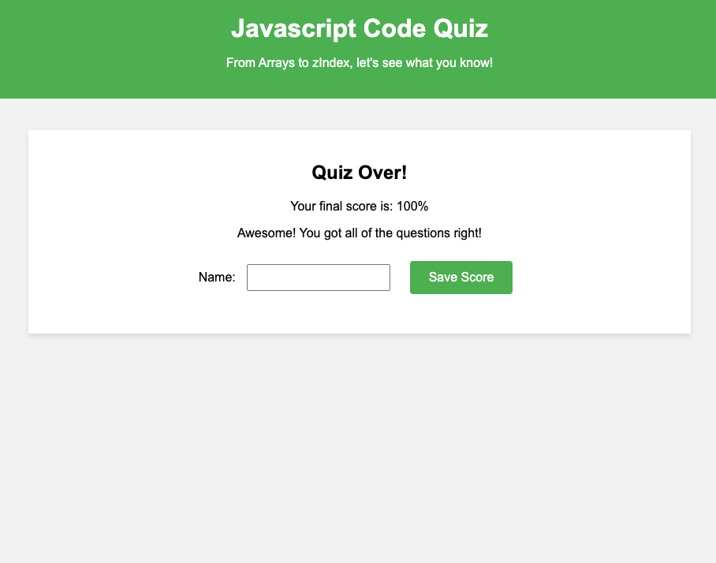

# Javascript Code Quiz

## Table of Contents

- [Overview](#overview)
- [Preview](#preview)
- [Deployed Link](#deployed-link)

## Overview

As a developer, I want to create a quiz app that asks the user questions to test their Javascript knowledge.
I want the quiz to offer multiple choice questions.
I want the quiz to have a one-minute timer.
I want the app to calculate the user's score after all of the questions have been answered, or after the time runs out.
If the user has one of the five highest recorded scores, I want that user's name and score to be displayed on a top five list.
I want the app to clear stored scores if requested.

## Preview

## Deployed Link

[Link to quiz](https://winstonheard.github.io/code-quiz/) 

